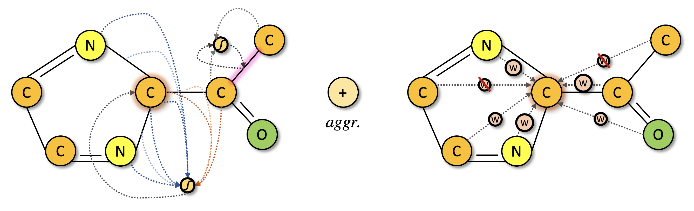

# Spatial Graph Attention


This repository is the official implementation of Spatial Graph Attention Network (sGAT) within the paper [**Spatial Graph Attention and Curiosity-driven Policy for Antiviral Drug Discovery**](https://arxiv.org/abs/2106.02190). Our policy networks built upon sGAT can be found [here](https://github.com/njchoma/DGAPN).


## Installation

### 1. Create Conda Environment
```bash
conda create -n sgat-env --file requirements.txt
conda activate sgat-env
```

### 2. Install Learning Libraries
- [Pytorch](https://pytorch.org/) [**1.8**.0](https://pytorch.org/get-started/previous-versions/)
- [Pytorch Geometric](https://pytorch-geometric.readthedocs.io/en/latest/) [**1.7**.0](https://pytorch-geometric.readthedocs.io/en/1.7.0/notes/installation.html)

  \* *make sure to install the right versions for your toolkit*


## Run
Once the environment is set up, the function call to train & evaluate sGAT is:

```bash
./main.sh &
```

A list of flags may be found in `main.sh` and `src/main.py` for experimentation with different network parameters. The run log and models are saved under `*artifact_path*/saves`, and the tensorboard log is saved under `*artifact_path*/runs`.

## Pre-trained Models
A trained sGAT model on [a sub-dataset of molecules and scores for docking in the catalytic site of NSP15](https://github.com/yulun-rayn/SGAnCP4ADD/tree/main/dataset/NSP15_6W01_A_3_H.negonly_unique_30k.csv) can be found [here](https://github.com/yulun-rayn/SGAnCP4ADD/tree/main/artifact/sgat).

## License

Contributions are welcome! All content here is licensed under the MIT license.
